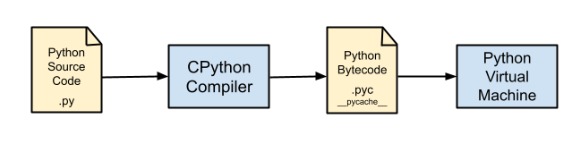

# From Python Source Code to Execution

Python is an interpreted language, but it doesn’t directly execute the source code.

When we run a Python program, the execution process involves several distinct
steps:

1.  **Source Code**:
    The process begins with the `.py` files containing the human-readable Python
    code written by the developer.

2.  **Compilation**:
    The Python interpreter first compiles the source code into an intermediate
    representation called **bytecode**. During this phase, the interpreter
    checks for syntax errors. If the code is valid, it is translated into
    bytecode.

    This compilation happens automatically. To speed up future executions
    (specifically for imported modules), Python caches the compiled bytecode in
    `.pyc` files, typically stored in a directory named `__pycache__`.

3.  **Bytecode**:
    Bytecode is a low-level, platform-independent set of instructions. It is not
    machine code that the CPU can execute directly; rather, it is a specific
    instruction set designed for the Python interpreter. This makes Python code
    portable across different operating systems. However, the **bytecode format is
    not standardized and depends on the Python version**.

4.  **Python Virtual Machine (PVM)**:
    The PVM is the runtime engine of Python. It acts as a loop that iterates
    through the bytecode instructions one by one. The PVM translates these
    abstract bytecode instructions into machine-executable instructions for the
    specific underlying hardware and operating system. While the bytecode is
    platform-independent, the PVM implementation is platform-specific (e.g.,
    tailored for Windows, Linux, or macOS).

## References

* [An introduction to Python bytecode](https://opensource.com/article/18/4/introduction-python-bytecode)

*Egon Teiniker, 2020-2026, GPL v3.0*
