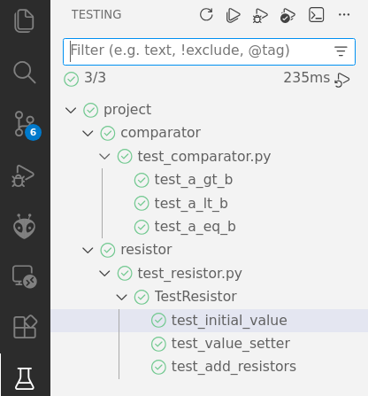
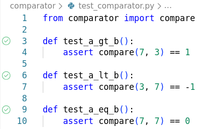

# VS Code Testing

When the Python extension is installed and a Python file is open within 
the editor, a **test beaker icon** displays on the VS Code Activity Bar 
representing the **Test Explorer** view. 



Tests can be configured anytime by using the `Python: Configure Tests` 
command from the Command Palette or by setting `python.testing.pytestEnabled` 
in the Settings editor or `settings.json` file.

```json
  // Enable pytest as the test framework
  "python.testing.pytestEnabled": true,
  "python.testing.pytestArgs": [
    "."
  ],
```

We can run tests using any of the following actions:

* With a **test file** open, select the **green run icon** that is displayed in 
    the gutter next to the test definition line, as shown in the previous section. 
    This command **runs only that one method**.

    

* From the Test Explorer:

    * To **run all discovered tests**, select the play button at the top 
        of Test Explorer.

    * To **run a specific group of tests, or a single test**, select the file, 
        class, or test, then select the play button to the right of that item.    


## References

* [Python testing in Visual Studio Code](https://code.visualstudio.com/docs/python/testing)

*Egon Teiniker, 2020-2026, GPL v3.0*
