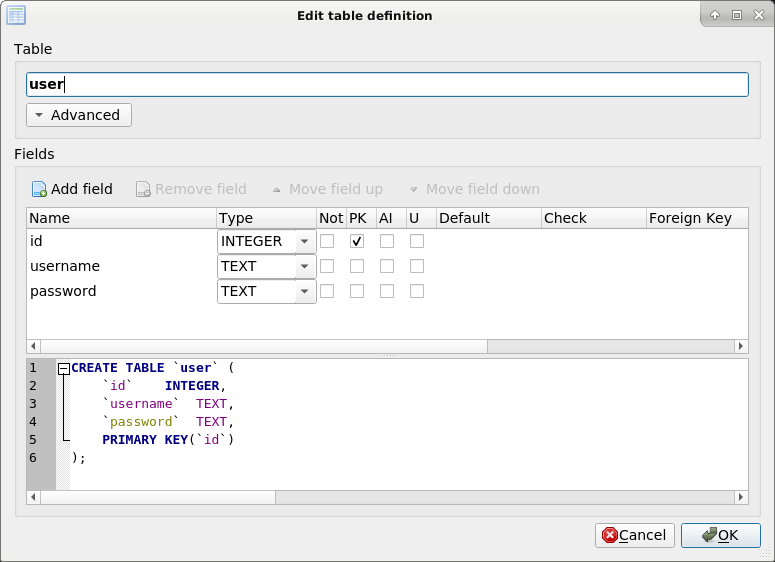

# SQLite DB Browser

The **DB Browser for SQLite** is a visual tool to create, design, and edit 
database files compatible with SQLite. It is a free and open-source tool 
that runs on Linux, macOS, and Windows.

* **New Database** -> Save As -> `test.db`

* **Table**: `user`

  

  * Columns: 
    - `id` (INTEGER) Primary Key
    - `username` (TEXT), 
    - `password` (TEXT)

* **Browse Data**: 
  - Insert new record
  - Edit record
  - Delete record

* **Execute SQL**: 
  - Create Table
    ```SQL
    CREATE TABLE user (id INTEGER, username TEXT, password TEXT, PRIMARY KEY(id));
    ```

  - Insert Data
    ```SQL
    INSERT INTO user (id,username, password) VALUES (1, 'homer', '2aaab795b3836904f82efc6ca2285d927aed75206214e1da383418eb90c9052f');
    INSERT INTO user (id,username, password) VALUES (2, 'marge', 'b4b811fa40505329ae871e52f03527c3720c9af7fb8607819658535c5484c41e');
    INSERT INTO user (id,username, password) VALUES (3, 'bart', '9551dadbf76a27457946e70d1aebebe2132f8d3bce6378d216c11853524dd3a6');
    INSERT INTO user (id,username, password) VALUES (4, 'lisa', 'd84fe7e07bedb227cffff10009151d96fc944f6a1bd37cff60e8e4626a1eb1c3');
    INSERT INTO user (id,username, password) VALUES (5, 'maggie', 'aae5be5f6474904b686f639e0fcfd2be440121cd889fa381a94b71750758345e');
    ```

  - Select Data
    ```SQL
    SELECT * FROM user;

    SELECT id,username FROM user;

    SELECT id,username,password FROM user WHERE id=3;

    SELECT id,username,password FROM user WHERE username LIKE 'm%';
    ```

  - Update Data
    ```SQL
    UPDATE user SET password=1234567 WHERE id=3;
    ```

  - Delete Data
    ```SQL
    DELETE FROM user WHERE id=1;
    ```

  - Drop Table
    ```SQL
    DROP TABLE user;
    ```

* **Close Database**


## Command Line

The **SQLite command-line interface (CLI)** is a simple, interactive shell allowing us 
to manage, explore, and manipulate SQLite databases directly from the terminal.

In the SQLite CLI, there are two types of commands:

* **Meta-commands**: Begin with a period (`.`) and manage the SQLite CLI itself.
* **SQL statements**: Standard SQL queries (end with semicolons `;`).


### Meta-commands

| Command             | Description                                          |
|---------------------|------------------------------------------------------|
| `.help`             | Lists available CLI commands                         |
| `.tables`           | Lists all tables in the current database             |
| `.schema`           | Shows the SQL CREATE statements for tables and views |
| `.schema tablename` | Shows schema for a specific table                    |
| `.databases`        | Lists attached databases                             |
| `.mode MODE`        | Sets output format (`csv`, `column`, `json`, etc.)   |
| `.headers on/off`   | Toggles column headers on/off in output              |
| `.exit` or `.quit`  | Exits the SQLite CLI                                 |
| `.read filename`    | Executes SQL commands from a file                    |
| `.output filename`  | Redirects output of commands to a file               |
| `.import FILE TABLE`| Imports data from FILE into TABLE                    |


```bash
$ sqlite3 test.db

sqlite> .tables
user

sqlite> .schema user
CREATE TABLE IF NOT EXISTS "user" (
        "id"    INTEGER,
        "username"      TEXT,
        "password"      TEXT,
        PRIMARY KEY("id")
);

.quit
```

### Running SQL Statements

We can execute any valid SQL commands directly. 

**Always terminate commands with `;`**

```bash
$ sqlite3 test.db

sqlite> CREATE TABLE user (id INTEGER, username TEXT, password TEXT, PRIMARY KEY(id));

sqlite> INSERT INTO user (id,username, password) VALUES (1, 'homer', '2aaab795b3836904f82efc6ca2285d927aed75206214e1da383418eb90c9052f');
sqlite> INSERT INTO user (id,username, password) VALUES (1, 'homer', '2aaab795b3836904f82efc6ca2285d927aed75206214e1da383418eb90c9052f');
sqlite> INSERT INTO user (id,username, password) VALUES (2, 'marge', 'b4b811fa40505329ae871e52f03527c3720c9af7fb8607819658535c5484c41e');
sqlite> INSERT INTO user (id,username, password) VALUES (3, 'bart', '9551dadbf76a27457946e70d1aebebe2132f8d3bce6378d216c11853524dd3a6');
sqlite> INSERT INTO user (id,username, password) VALUES (4, 'lisa', 'd84fe7e07bedb227cffff10009151d96fc944f6a1bd37cff60e8e4626a1eb1c3'););
sqlite> INSERT INTO user (id,username, password) VALUES (5, 'maggie', 'aae5be5f6474904b686f639e0fcfd2be440121cd889fa381a94b71750758345e');
 
sqlite> SELECT * FROM user;
1|homer|2aaab795b3836904f82efc6ca2285d927aed75206214e1da383418eb90c9052f
2|marge|b4b811fa40505329ae871e52f03527c3720c9af7fb8607819658535c5484c41e
3|bart|9551dadbf76a27457946e70d1aebebe2132f8d3bce6378d216c11853524dd3a6
4|lisa|d84fe7e07bedb227cffff10009151d96fc944f6a1bd37cff60e8e4626a1eb1c3
5|maggie|aae5be5f6474904b686f639e0fcfd2be440121cd889fa381a94b71750758345e

sqlite> UPDATE user SET password=1234567 WHERE id=3;

sqlite> DELETE FROM user WHERE id=1;

sqlite> DROP TABLE user;

sqlite> .quit
```

## Setup 

SQLite and DB Browser can be installed using the package manager:

```bash
$ sudo apt install sqlite3
$ sudo apt install sqlitebrowser
```

## References

* [SQLite Homepage](https://www.sqlite.org/)
* [SQLite Documentation](https://www.sqlite.org/docs.html)

* [DB Browser for SQLite](https://sqlitebrowser.org/)

*Egon Teiniker, 2020-2025, GPL v3.0*