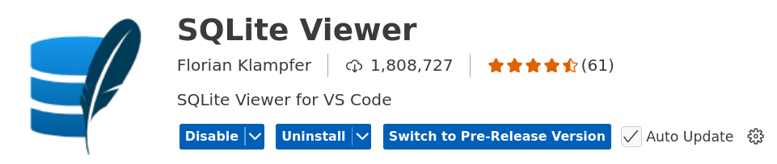

# SQLite Viewer for VS Code

SQLite Viewer is a quick and easy SQLite viewer for VS Code, 
inspired by DB Browser for SQLite.

* Platform-independent, no native dependencies — it even works in VS Code for Web
* File extension association: Just click on a `.sqlite` or `.db` file 
    and the custom editor opens
* Fast UI with virtualized scrolling, sorting, filtering, etc.
* Seamlessly integrates with VS Code 

Please note that editing and extending data is only possible in the Pro version.

## References

* [SQLite Viewer](https://marketplace.visualstudio.com/items?itemName=qwtel.sqlite-viewer)

*Egon Teiniker, 2020-2025, GPL v3.0*