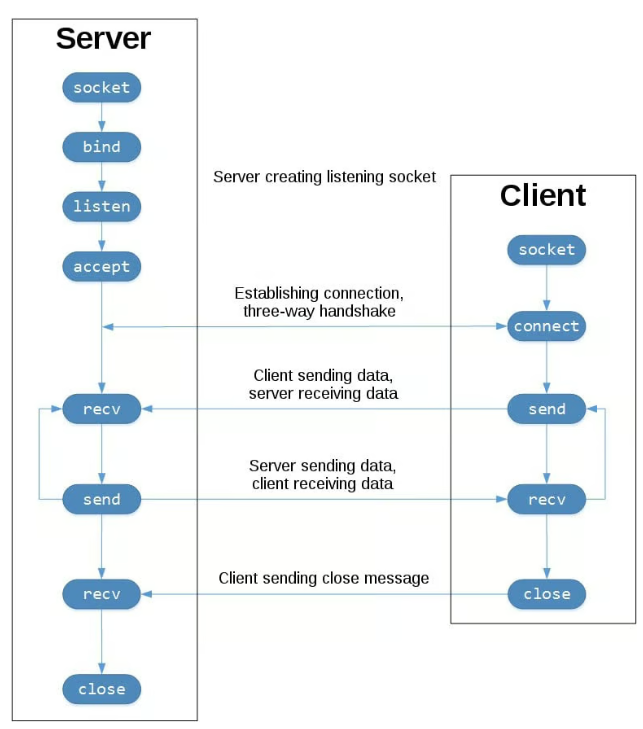

# Socket Programming 

Socket programming in Python refers to the use of network sockets to enable communication 
between two or more devices over a network. A socket is essentially an endpoint in a 
**two-way communication** link between programs running on a network. It's used to send and 
receive data across a network, enabling applications to communicate over the internet or 
local networks.

> A **Socket** is an endpoint defined by an **IP address and port number** 
> combination (e.g., `127.0.0.1:8080`). It acts as a gateway for data exchange.

The most common type of socket applications are **client-server applications**, where one 
side acts as the server and waits for connections from clients.




_Figure: TCP Socket Flow ( [Real Python: Socket Programming in Python](https://realpython.com/python-sockets/))_ 

## Server Side

A **Server** waits for and accepts connections from clients, handles incoming requests, 
and sends responses.

1. Create a socket.
2. Bind the socket to an IP and port.
3. Listen for incoming connection requests.
4. Accept connections from clients.
5. Send/receive data to/from the client.
6. Close the connection.

```Python
import socket

# Create a TCP/IP socket
server_socket = socket.socket(socket.AF_INET, socket.SOCK_STREAM)

# Bind the socket to a local address and a port
server_address = ('localhost', 12345)
server_socket.bind(server_address)

# Listen for incoming connections (backlog of 1 connection)
server_socket.listen(1)
print(f"Server listening on {server_address[0]}:{server_address[1]}...")

while True:
    # Wait for a connection
    client_socket, client_address = server_socket.accept()
    try:
        print(f"Connection from {client_address}")

        # Receive the data in small chunks and retransmit it
        data = client_socket.recv(1024).decode('utf-8')
        if data:
            print(f"Received: {data}")
            response = "Hello from server!"
            client_socket.send(response.encode('utf-8'))
    finally:
        # Clean up the connection
        client_socket.close()
```

## Client Side

A **Client** initiates communication by connecting to the server's socket to exchange data.

1. Create a socket.
2. Connect to the server's socket.
3. Send/receive data.
4. Close the connection.

```Python
import socket

# Create a TCP/IP socket
client_socket = socket.socket(socket.AF_INET, socket.SOCK_STREAM)

# Connect the socket to the server's address and port
server_address = ('localhost', 12345)
client_socket.connect(server_address)
try:
    # Send data to the server
    message = "Hello from client!"
    print(f"Sending: {message}")
    client_socket.send(message.encode('utf-8'))

    # Look for the response
    response = client_socket.recv(1024).decode('utf-8')
    print(f"Received: {response}")
finally:
    # Close the socket to clean up
    client_socket.close()
```

## Python Socket API 

Python’s **socket module** provides an interface to the Berkeley sockets API
which is convenient and maps directly to system calls.

* `socket()`: Creates a socket object.
    - socket.SOCK_STREAM: TCP socket.
    - socket.SOCK_DGRAM: UDP socket.

* `bind()`: Associates a socket with a specific IP and port.

* `listen()`: Enables a socket to accept connections.

* `accept()`: Accepts an incoming connection request.

* `connect()`: Connects the socket to a remote server.

* `send()` / `sendall()`: Sends data.

* `recv()`: Receives data.

* `close()`: Closes the socket.


## Client-Server Architectures 

Socket communication allows **integration of applications written in 
different programming languages** by providing a common, 
language-independent protocol for exchanging data. 

* **Standardized Protocol:**
    - Socket programming typically uses standardized protocols like 
    **TCP/IP** or **UDP/IP**, which define clear rules for data exchange. 
    Because these protocols are universal, any programming language with 
    socket support can communicate using them.

* **Language-agnostic Data Representation:**
    - Communication via sockets typically involves **sending raw bytes**. 
    Applications agree on a common data format (e.g., plain text, JSON, 
    XML, or binary protocols), which is independent of programming languages.

* **Client-Server Architecture:**
    - A common way to integrate applications is to establish a 
    client-server model.
    - One application acts as a **server** (e.g., Python script listening 
    on a socket), while another acts as a **client** (e.g., Java or C++ 
    application connecting to that socket).

* **Interoperability:**
    - Because sockets are supported in almost all modern programming languages, 
    integration is highly flexible.

    - Example languages with socket APIs include:
    - **Python:** `socket` module
    - **Java:** `java.net.Socket` and `ServerSocket`
    - **C/C++:** POSIX sockets (`sys/socket.h`)
    - **JavaScript (Node.js):** `net` module
    - **C#:** `System.Net.Sockets`

* **Use-Cases:**
    - Cross-platform applications
    - Microservices and distributed systems
    - Integration of legacy systems with modern applications
    - Data exchanges between heterogeneous systems


## References

* [YouTube (Real Python): Creating a Simple Socket Server and Client in Python](https://youtu.be/sUzM-vIC-s4?si=NZ8YA6E64phMob3Y)

* [Real Python: Socket Programming in Python](https://realpython.com/python-sockets/)
* [Python Standard Library: Low-level networking interface](https://docs.python.org/3/library/socket.html)


*Egon Teiniker, 2020-2025, GPL v3.0*